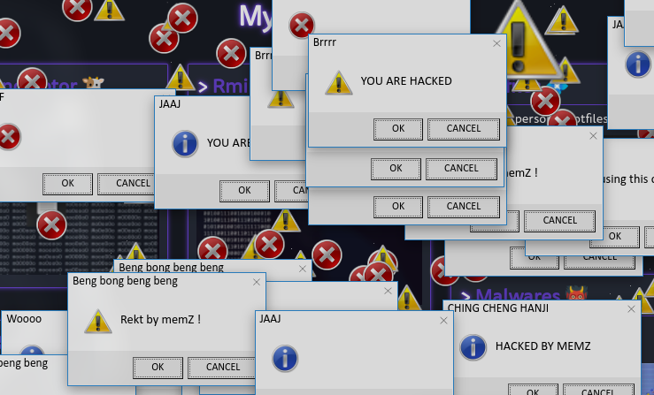
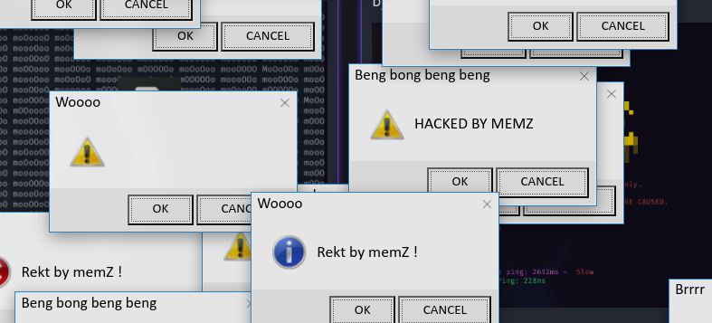
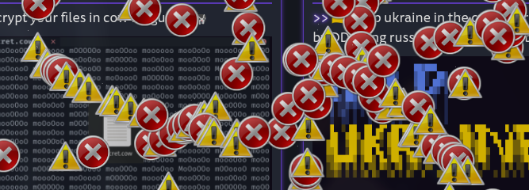
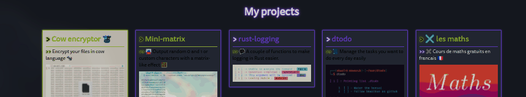
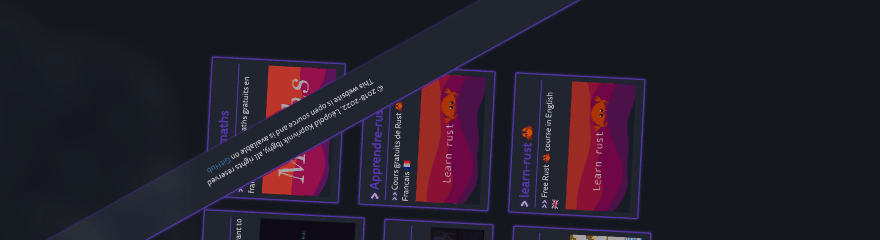
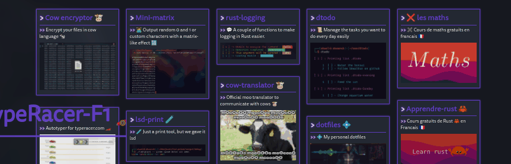
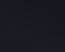

# Memz.js

👾 Library to simulate memz-like virus in a browser



# jsDelivr

```html
<script src="https://cdn.jsdelivr.net/gh/SkwalExe/memz.js@v0.1.0/dist/memz.min.js"></script>
```

# NPM module 

Install the npm module 

```bash
npm install memz
```

And import it in your project 

```js
const Memz = require('memz');
```

**⚠️ You will need to bundle the package with your application (for example with browserify) because this library only works in the browser**

```bash
browserify index.js -o bundle.js
```

# Setting up 

You can import the library into you website with [JsDelivr](#JsDelivr) or, you can use the [npm module](#NPM-module) and import it in your project.

**You also need to import the css file to your website**

```html
<link rel="stylesheet" href="https://cdn.jsdelivr.net/npm/windowsmessagebox@0.4.1/dist/wmsgbox.min.css">
```

# Usage 📝

This library provides 10 functions:

- [`Memz.all()`](#memzall)
- [`Memz.original()`](#memzoriginal)
- [`Memz.errorSounds()`](#memzerrorsounds)
- [`Memz.music()`](#memzmusic)
- [`Memz.messageBoxes()`](#memzmessageboxes)
- [`Memz.errorIcon()`](#memzerroricon)
- [`Memz.invertColors()`](#memzinvertcolors)
- [`Memz.rotateElements()`](#memzrotateelements)
- [`Memz.zoomElements()`](#memzzoomelements)
- [`Memz.blockAllInputs()`](#memzblockallinputs)
- [`Memz.changeCursor()`](#memzchangecursor)

## `Memz.all()`

The `Memz.all()` function executes all the functions below at the same time.

## `Memz.original()`

Imitates the original behavior of Memz.

## `Memz.errorSounds()`

This function plays windows error sounds randomly.

## `Memz.music()`

This function plays the [Issou night club](https://www.youtube.com/watch?v=oXxQX8Tlg9M) music in loop.

## `Memz.messageBoxes()`

This function creates message boxes with random messages at a random position on the page.



## `Memz.errorIcon()`

This function puts little error icons next to the mouse cursor every ~100 milliseconds.



## `Memz.invertColors()`

This function inverts the color of a random element on the page every 100 milliseconds.



## `Memz.rotateElements()`

This function rotates a random element on the page every 100 milliseconds.



## `Memz.zoomElements()`

This function zooms a random element on the page every 100 milliseconds.



## `Memz.blockAllInputs()`

This function blocks all inputs on the page.

## `Memz.changeCursor()`

This function changes the cursor to a random one every 15 milliseconds.



# final

If you have any problem, don't hesitate to open an issue

# contributing

1. Start by [**forking** this repository](https://github.com/SkwalExe/memz.js/fork)

2. Then clone your fork to your local machine.
  ```git
  git clone https://github.com/your-username/memz.js.git
  ```

3. Install dev dependencies
  ```npm
  npm install --save-dev
   ```

4. Create a new branch
  ```git
  git checkout -b super-cool-feature
  ```

5. Then make your changes

6. Update the changelog and version number if needed (using [Semantic Versioning](https://semver.org)) also, update the version number in the JsDelivr links (js and css) 
  ```bash
  # bug fix
  npm version patch --no-git-tag-version

  # add a new feature 
  npm version minor --no-git-tag-version
  
  # changes that break backwards compatibility
  npm version major --no-git-tag-version
  ```

7. List and correct linting errors
  ```bash
  npm run lint
  ```

8. Update the minified/browser version of the library
  ```bash
  npm run build
  ```

9. Once you're done, commit your changes and push them to the remote repository.
  ```git
  git add --all
  git commit -m "Add super-cool-feature"
  git push origin super-cool-feature
  ```

10. Then, open a pull request on GitHub from your fork.
   1. Go to [this link](https://github.com/SkwalExe/memz.js/compare/)
   2. Click compare across forks
   3. On the right, on `head repository` select your fork
   4. And on `compare` select the branch you just created
   5. Click on `Create Pull Request` and submit your pull request

<a href="https://github.com/SkwalExe#ukraine"></a>